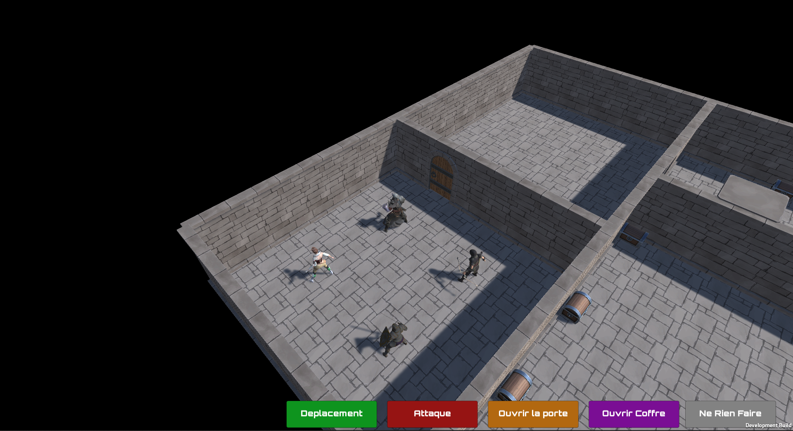

<h2>Project Name : Donjons et Dragons</h2>

<strong>Description</strong> : <code>Website of the S2 project carried out under the supervision of epita - Dungeons and Dragons</code> 

<strong>Author</strong> :  <code>Sacha LAYANI</code> | <code>Vincent BENSADI</code> | <code>Hamza NAJI</code> | <code>Matthieu FOULIARD</code> 
 

<strong>Date</strong> :  <code>June 2022</code>
 

<strong>Website Link</strong> : <a href="https://donjons-et-dragons.herokuapp.com/">https://donjons-et-dragons.herokuapp.com/</a>

